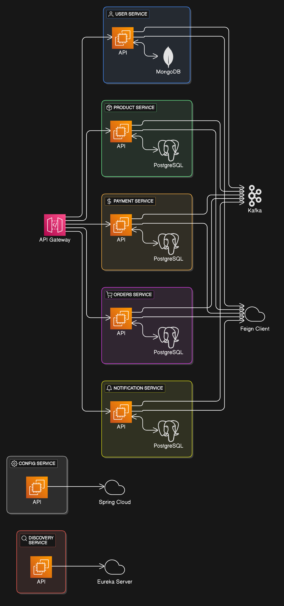

## ecommerce-microservice-backend
### A  Flow diagram of the application

### Microservice patterns used
- Circuit Breakers
- API Gateway
- Service Discovery
- External Configuration

### Microservice principles
- Scalability 
- Availability 
- Resiliency
- Independent
- Failure isolation
- Continuous delivery through DevOps

## Tools used and their functions
- [Thymeleaf](https://www.thymeleaf.org/documentation.html) - Thymeleaf, a Java-based templating engine,
  dynamically renders HTML content. It was used to generate a goof UI for the email notification
- [API Gateway](https://spring.io/projects/spring-cloud) - it's a single entry point for all clients requests.
- [Service Discovery](https://cloud.spring.io/spring-cloud-netflix/reference/html/) - Manages dynamic service registration and discovery.
Enables auto-scaling and load balancing by allowing the API Gateway and services to locate instances dynamically.
- [Config Server](https://docs.spring.io/spring-cloud-config/docs/current/reference/html/) - Centralizes configuration management for all microservices e.g db credentials,each services yml configurations
- [Kafka](https://kafka.apache.org/documentation/)- it helps in asynchronous communication between services(e.g Orders -> payments, orders-> products). This helps in managing faults and improves scalability. It also guarantees event delivery even during service failures.
- [Feign Client](https://docs.spring.io/spring-cloud-openfeign/docs/current/reference/html/) -  REST client for synchronous inter-service calls(e.g getting user data while you are in orders service i.e Order -> User service)

#### Databases
[ MongoDB ](https://www.mongodb.com/docs/manual/tutorial/) -  Optimized for `unstructured data` and `horizontal scaling`. Used in users just to show how one can use multiple databases in one application/different services

 [ PostgreSQL ](https://www.postgresql.org/docs/) - Provides `relational integrity`, `transactions`, and `complex query support`**(ACID)**
